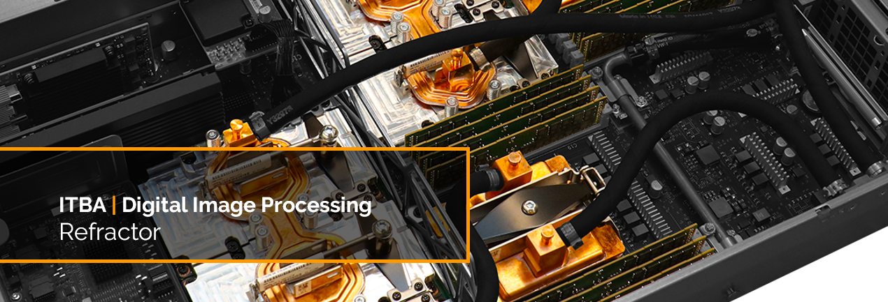

[](https://github.com/agustin-golmar/Refractor)
[](http://www.oracle.com/technetwork/java/javase/downloads/index.html)
[](https://github.com/agustin-golmar/Refractor/releases)
[](https://www.travis-ci.com/agustin-golmar/Refractor)

# Refractor

A user interface for refract images (i.e., separate, unfold, hash, cut, break,
etc.), and extract relevant information from them (like other images).

## Build

To build the project, it is necessary to have _Maven +3.5.0_, and
_Java SE 10 Release_ installed. Then, run:

```
$ mvn clean package
```

This will generate a _\*.jar_ in the root folder. If you find any issues with
the building, remove the _\*.jar_ files from the _Maven_ local repository
with:

```
$ rm -fr ~/.m2/repository/ar/nadezhda/*
```

Or do it manually, if you prefer.

## Execution

In the root folder (after build), type:

```
$ java -jar target/refractor-1.0-SNAPSHOT.jar
```

## Designer

This project has been built, designed and maintained by:

* [Juan Pablo Dantur](https://github.com/jpdantur)
* [Agustín Golmar](https://github.com/agustin-golmar)

## Bibliography

__"Digital Image Processing"__. Rafael C. González, Richard E. Woods.
_Pearson. ISBN 978-0133356724. 2018_.
